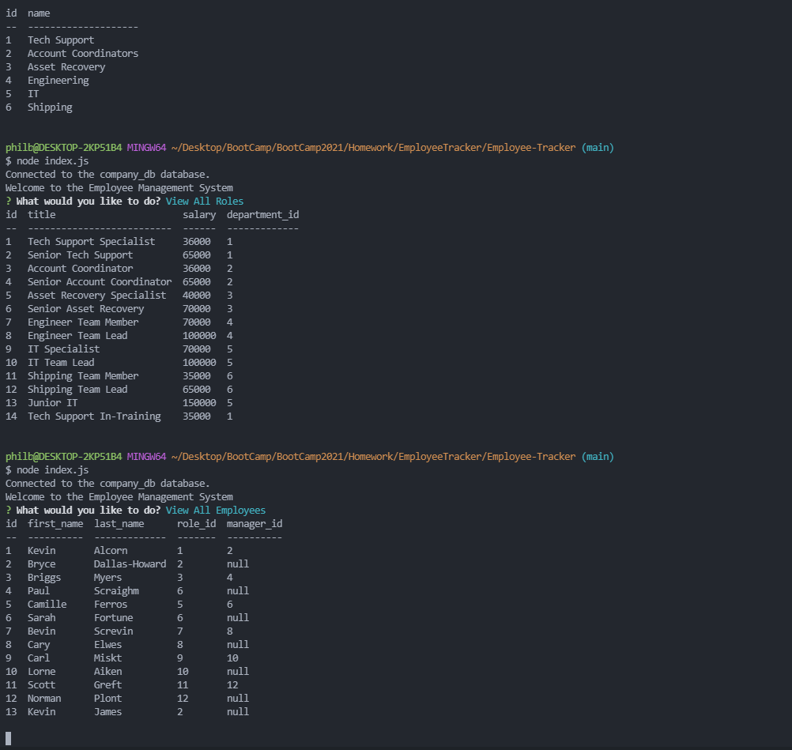

# Employee-Tracker

## Description 

This application allows for vision into and manipulation of an employee database for a sample company. The database, utilizing mySQL, holds tables for deparments, roles, and individual employees. Inquirer is used to run command-line prompts in which the user can see data for specific tables, add departments and roles, and update employee information.  

Here is a screenshot of the app: 

Here is a link to the video of this project in action: [Test of Application](https://www.youtube.com/watch?v=Wl3DhcpAzjA)

## Table of Contents

-- [Installation](#installation)

-- [Usage](#usage)

-- [License](#license)

-- [Contributing](#contributing)

-- [Tests](#tests)

-- [Questions](#questions)

## Installation
  
To install necessary dependencies, run the following command:

    npm i

## Usage

Run the application with the following command:

    node index.js

Inquirer will prompt to select from a list of options. The user can select to View All Deparments/Roles/Employees, Add a Deparment/Role/Employee, Update an Employee Role, or Quit the application. Viewing items will utilize the company_db database to show information, organized into tables, to the user. Adding items will allow for entry of information into the relevant fields which will then be added to, and stored in, the database in the appropriate table. Updating an Employee Role will prompt the user to select and employee and supply the desired role change. 

## License

This project is protected under the [MIT](https://choosealicense.com/licenses/mit/) license. (2021) (Phil Bohn)

## Contributing

N/A

## Tests

N/A

## Questions

If there any questions regarding this project, I can be contacted in the following places:

GitHub: [@lamperouge1218](https://github.com/lamperouge1218)

Email: philbohn1791@gmail.com
